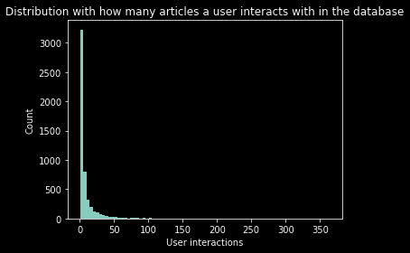
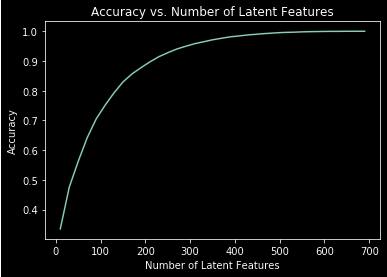
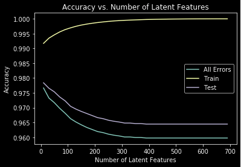

# Project: Recommendation Engine for articles

## Table of Content

- [Project Overview](#overview)
- [Project Software Stack](#stack)
- [Graphs](#graphs)
- [File Structure](#files)
- [Software Requirements](#sw_requirements)
- [Conclusion](#conclusion)
- [Links](#links)

## 1. Project Overview

1.1 Project Introduction

The aim is to develop a recommendation engine in Python to suggest new articles to a community of users.

In this project I will analyze the interactions that users have with articles on the IBM Watson Studio platform and make recommendations to them about new articles.

In order to determine which articles to show to each user, we will be performing a study of the data available on the IBM Watson Studio platform. 

1.2 Project Steps

1.2.1 Exploratory Data Analysis

Before making recommendations of any kind, we will need to explore the data of this project. We will perform a short EDA. 

1.2.2 Rank Based Recommendations

To build recommendations, we will first find the most popular articles simply based on the most interactions. Since there are no ratings for any of the articles, it is easy to assume the articles with the most interactions are the most popular. These are then the articles we might recommend to new users.

1.2.3 User-User Based Collaborative Filtering

In order to build better recommendations for the users of the platform, we will look at users that are similar in terms of the items they have interacted with. These items could then be recommended to the similar users. This would be a step in the right direction towards more personal recommendations for the users. 

1.2.4 Matrix Factorization

Finally, we will perform a machine learning approach to building recommendations. Using the user-item interactions, we will build out a ML model. We will get an idea of how well we can predict new articles an individual might interact with.

1.3 Data for the project 

- user-item-interactions.csv: file contains user interaction
- articles_community.csv: file contains articles description

## 2. Project Software Stack

The project uses **Python 3.7** and additional libraries. 

Additional libraries:

* Pandas
* Numpy
* Matplotlib
* Pickle
* progressbar
* sklearn

## 3. Graphs

**_Screenshot 1_**

**_Screenshot 2_**

**_Screenshot 3_**

## 4. File Structure

<pre>
.
├── data
│   ├── articles_community.csv-------------------# Data as csv file for articles 
│   └── user-item-interactions.csv---------------# Data as csv file for user articles interaction
├── images
│   ├── Graph_01.png-----------------------------# Graph about user/article interaction
│   ├── Graph_02.png-----------------------------# Graph about accuracy
│   └── Graph_03.png-----------------------------# Graph about accuracy and features for train/test split
├── README.md -----------------------------------# Readme
├── Recommendation_Engine_IBM_D03.html ----------# Code as html
├── Recommendation_Engine_IBM_D03.ipynb ---------# Code as Python notebook
│
.
</pre>

## 6. Conclusion

* 50% of individuals interact with 3 articles or fewer.
* The maximum number of user-article interactions by any 1 user is 364.
* The number of unique articles that have an interaction with a user is 714.
* The number of unique articles in the dataset is 1051.
* The number of unique users in the dataset is 5149.
* The number of user-article interactions in the dataset is 45993.
* The mosed viewed article in the dataframe was viewed 937 times. 

The distribution of how many articles a user interacts with in the dataframe.

The figures in the graph shows that the accuracy of the ML model is very high.

But this could be a bit of a misleading result, because in in the data there is a class imbalance. 
The data as base for the ML model contain much more zeros than ones.
Training accuracy increase to near 100% as the number of latent features increases, as we can see in the graph.
While the testing accuracy decrease as the number of features increases. This could be due to a limited variety in the datasets.

